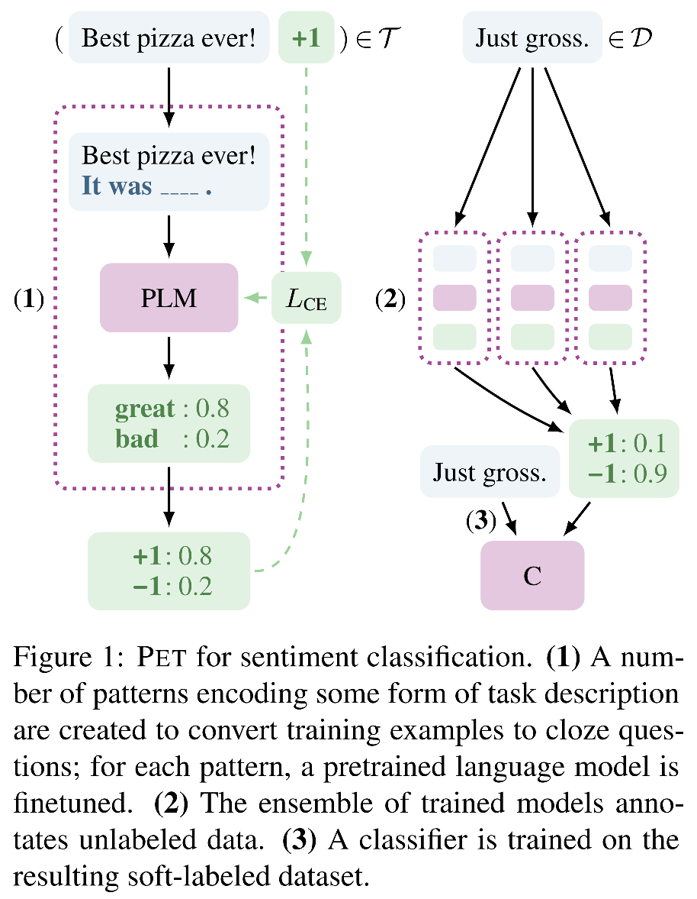
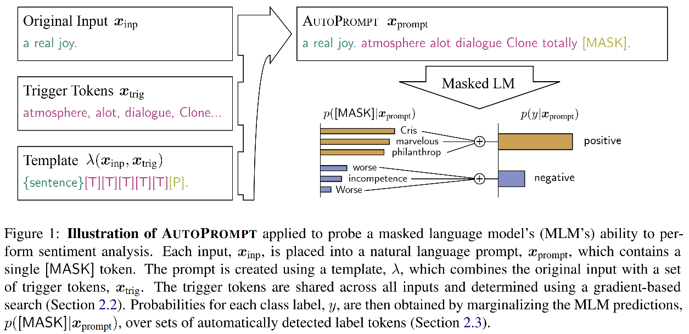
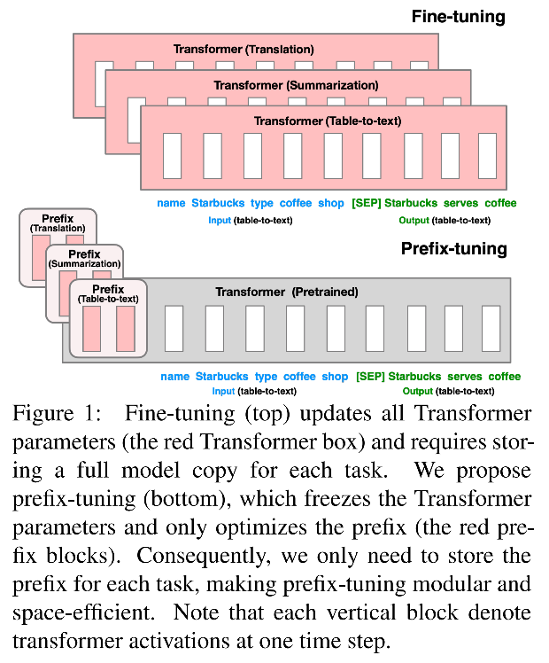

# Prompt Learning

## 目录
- [Prompt基础知识](#Prompt基础知识)
- [Prompt @ Recommendation](#Prompt--Recommendation)

# Prompt基础知识

### 1. Exploiting Cloze Questions for Few Shot Text Classification and Natural Language Inference (EACL 2021) [[pdf](./Paper/Prompt/Exploiting_Clone/Exploiting%20Cloze%20Questions%20for%20Few%20Shot%20Text%20Classification%20and%20Natural%20Language%20Inference%20-%20EACL%202021.pdf)]

`hard prompt` `MLM参数更新`

> ### Motivation
> - 由于语言、领域和任务的标注成本极高，在实际将语言模型应用到下游任务时，labeled samples很珍贵，few-shot场景非常常见，限制有监督学习，因而引起学者、从业者们对few-shot setting下执行NLP任务的关注。
> - 给预训练语言模型引入文本解释/任务描述，可以通过无监督方式有效解决一些NLP任务（zero-shot scenario）。
> - 综合考虑，本文提出引入pattern-exploiting-training，设计一种半监督训练策略PET和其改进版本iPET，将NLP的输入samples（text）映射为填空题形式（cloze-style phrase）。

Solution

> 

### 2. It’s Not Just Size That Matters - Small Language Models Are Also Few-Shot Learners (NAACL 2021) [[pdf](./Paper/Prompt/Not_Just_Size/It%E2%80%99s%20Not%20Just%20Size%20That%20Matters%20-%20Small%20Language%20Models%20Are%20Also%20Few-Shot%20Learners%20-%20NAACL%202021.pdf)]

`hard prompt` `MLM参数更新`
    
> ### Motivation
> - PET、iPET框架只能处理单个[mask]的完形填空，而实际任务可能会遇到多个[mask]。
> - 本文相当于PET、iPET的改进版本，将单[mask] token拓展到k个[mask] tokens。

<!-- 

Solution

> 

 -->

### 3. AUTOPROMPT: Eliciting Knowledge from Language Models with Automatically Generated Prompts (PrePrint 2020) [[pdf](./Paper/Prompt/AutoPrompt/Autoprompt%20-%20Eliciting%20knowledge%20from%20language%20models%20with%20automatically%20generated%20prompts%20-%20preprint.pdf)]

`soft prompt` `MLM参数固定？`

> ### Motivation
> - 在使用预训练语言模型时，将下游任务定义为填空题形式（任务->语言模型，与语言模型完美契合），使用prompt沟通预训练模型和下游任务，有助于评价预训练阶段学习到的知识情况，切无需引入大量的新参数。
> - 以往专家设计的prompt（hard prompt）成本高，对许多任务而言不直观，此外，模型对prompt包含的context信息高度敏感，因此人工设计的prompt容易引入bias。
> - 为此，本文提出自动学习prompt和label的方式。

Solution

> 

### 4. Prefix-Tuning: Optimizing Continuous Prompts for Generation (2021) [[pdf](./Paper/Prompt/Prefix/Prefix-Tuning%20-%20Optimizing%20Continuous%20Prompts%20for%20Generation.pdf)][[GitHub](https://github.com/XiangLi1999/PrefixTuning)]

`soft prefix prompt tokens` `hard input sample prompt tokens` `MLM参数固定`

> ### Motivation
> - 使用pre-train -> fine-tune范式将预训练语言模型应用下游任务时，通常需要更新预训练语言模型的参数。对不同任务需要分别fine-tune一次模型，并存储其参数，训练和存储开销昂贵。
> - 本文提出为每个任务训练连续的prefix prompt tokens（prefix of input samples），趋势语言模型执行不同任务。

Solution

> 

### 5. PADA: A Prompt-based Autoregressive Approach for Adaptation to Unseen Domains (2021) [[pdf](./Paper/Prompt/PADA/PADA%20-%20A%20Prompt-based%20Autoregressive%20Approach%20for%20Adaptation%20to%20Unseen%20Domains%20-%202021.pdf)]

`soft prompt` `MLM参数固定？`

> ### Motivation

# Prompt @ Recommendation
