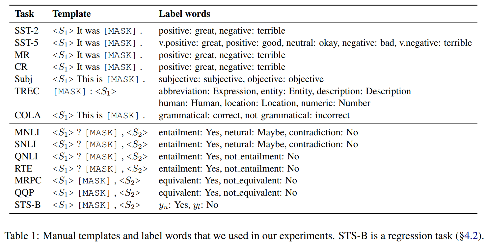
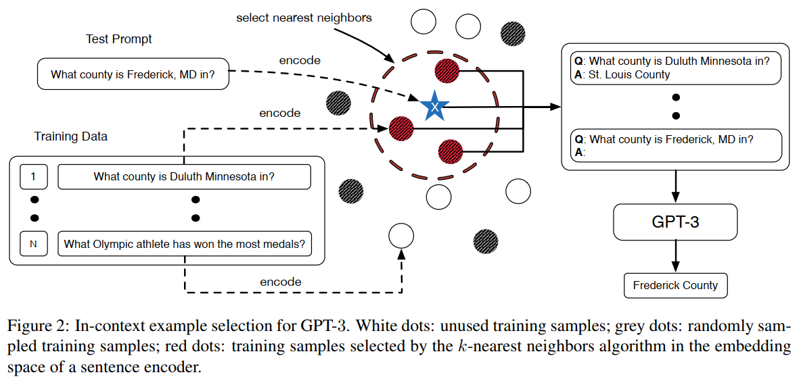
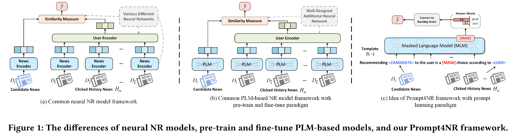
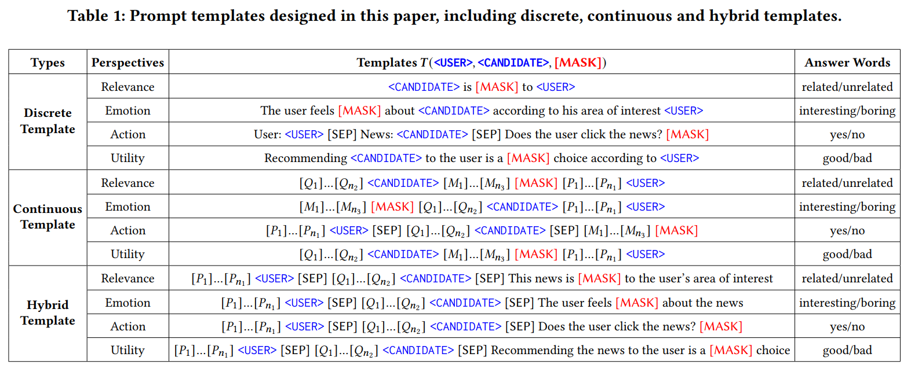
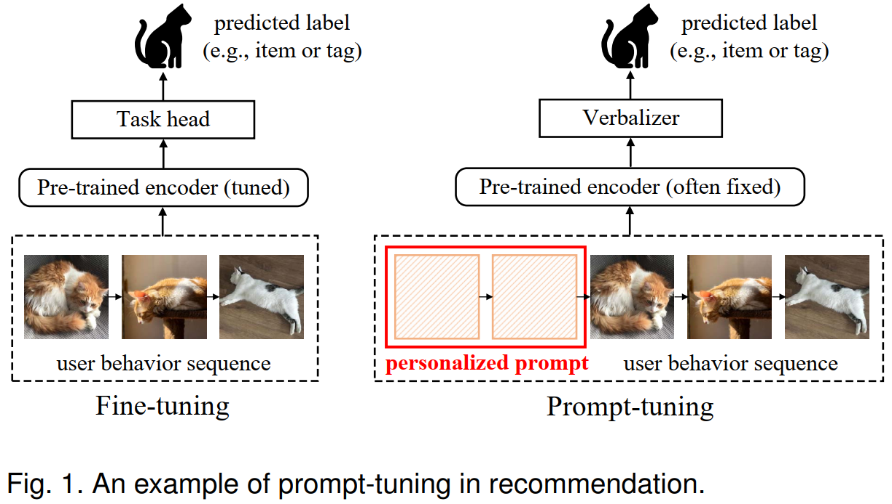
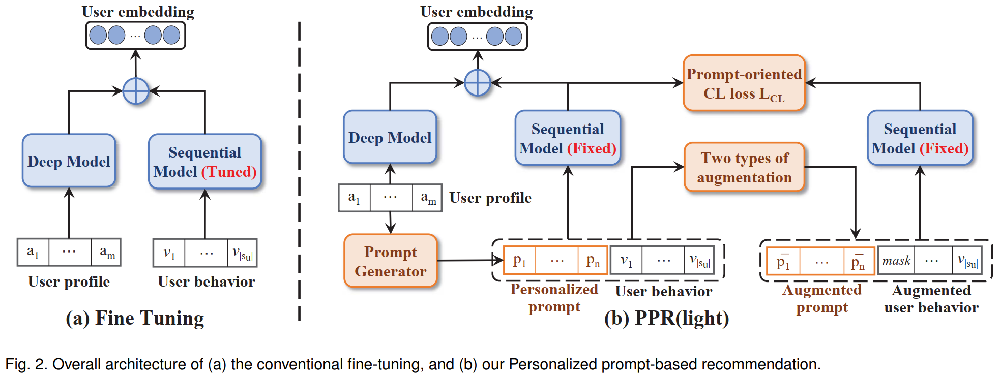

# Prompt Learning `Beta`

   

## Contents
- [Basics of Prompt](#basics-of-prompt)
- [Prompt @ Recommendation](#prompt--recommendation)

# Basics of Prompt

### 1. Exploiting Cloze Questions for Few Shot Text Classification and Natural Language Inference (EACL 2021) [[pdf](./Paper/Prompt/Exploiting_Clone/Exploiting%20Cloze%20Questions%20for%20Few%20Shot%20Text%20Classification%20and%20Natural%20Language%20Inference%20-%20EACL%202021.pdf)]

`hard prompt` `MLM参数更新`

> ### Motivation
> - 由于语言、领域和任务的标注成本极高，在实际将语言模型应用到下游任务时，labeled samples很珍贵，few-shot场景非常常见，限制有监督学习，因而引起学者、从业者们对few-shot setting下执行NLP任务的关注。
> - 给预训练语言模型引入文本解释/任务描述，可以通过无监督方式有效解决一些NLP任务（zero-shot scenario）。
> - 综合考虑，本文提出引入pattern-exploiting-training，设计一种半监督训练策略PET和其改进版本iPET，将NLP的输入samples（text）映射为填空题形式（cloze-style phrase）。

Solution

> 

### 2. It’s Not Just Size That Matters - Small Language Models Are Also Few-Shot Learners (NAACL 2021) [[pdf](./Paper/Prompt/Not_Just_Size/It%E2%80%99s%20Not%20Just%20Size%20That%20Matters%20-%20Small%20Language%20Models%20Are%20Also%20Few-Shot%20Learners%20-%20NAACL%202021.pdf)]

`hard prompt` `MLM参数更新`
    
> ### Motivation
> - PET、iPET框架只能处理单个[mask]的完形填空，而实际任务可能会遇到多个[mask]。
> - 本文相当于PET、iPET的改进版本，将单[mask] token拓展到k个[mask] tokens。

<!-- 

Solution

> 

 -->

### 3. AUTOPROMPT: Eliciting Knowledge from Language Models with Automatically Generated Prompts (PrePrint 2020) [[pdf](./Paper/Prompt/AutoPrompt/Autoprompt%20-%20Eliciting%20knowledge%20from%20language%20models%20with%20automatically%20generated%20prompts%20-%20preprint.pdf)]

`soft prompt` `MLM参数固定？`

> ### Motivation
> - 在使用预训练语言模型时，将下游任务定义为填空题形式（任务->语言模型，与语言模型完美契合），使用prompt沟通预训练模型和下游任务，有助于评价预训练阶段学习到的知识情况，切无需引入大量的新参数。
> - 以往专家设计的prompt（hard prompt）成本高，对许多任务而言不直观，此外，模型对prompt包含的context信息高度敏感，因此人工设计的prompt容易引入bias。
> - 为此，本文提出自动学习prompt和label的方式。

Solution

> 

### 4. Prefix-Tuning: Optimizing Continuous Prompts for Generation (2021) [[pdf](./Paper/Prompt/Prefix/Prefix-Tuning%20-%20Optimizing%20Continuous%20Prompts%20for%20Generation.pdf)][[GitHub](https://github.com/XiangLi1999/PrefixTuning)]

`soft prefix prompt tokens` `hard input sample prompt tokens` `MLM参数固定`

> ### Motivation
> - 使用pre-train -> fine-tune范式将预训练语言模型应用下游任务时，通常需要更新预训练语言模型的参数。对不同任务需要分别fine-tune一次模型，并存储其参数，训练和存储开销昂贵。
> - 本文提出为每个任务训练连续的prefix prompt tokens（prefix of input samples），趋势语言模型执行不同任务。

Solution

> 

### 5. PADA: A Prompt-based Autoregressive Approach for Adaptation to Unseen Domains (2021) [[pdf](./Paper/Prompt/PADA/PADA%20-%20A%20Prompt-based%20Autoregressive%20Approach%20for%20Adaptation%20to%20Unseen%20Domains%20-%202021.pdf)]

`soft prompt` `MLM`

> ### Motivation

### 6. WARP: Word-level Adversarial ReProgramming (ACL 2021) [[pdf](./Paper/Prompt/Warp/WARP%20-%20Word-level%20Adversarial%20ReProgramming%20-%20ACL%20-%202021.pdf)]

`soft prompt` `MLM参数固定，只更新插入的prompt和label`

> ### Motivation

Solution

> 

### 7. Making Pre-trained Language Models Better Few-shot Learners (2021) [[pdf](./Paper/Prompt/Few-shot_Learner/Making%20Pre-trained%20Language%20Models%20Better%20Few-shot%20Learners.pdf)]

<!-- `soft prompt` -->

> ### Motivation

Solution

> 

### 8. What Makes Good In-Context Examples for GPT-3? (2021) [[pdf](./Paper/Prompt/What_Makes_Good/What%20Makes%20Good%20In-Context%20Examples%20for%20GPT-3.pdf)]

<!-- `soft prompt` -->

> ### Motivation

Solution

> 

# Prompt @ Recommendation

### 1. Prompt Learning for News Recommendation (SIGIR 2023) [[pdf](./Paper/Recommendation/NewsRec/Prompt%20Learning%20for%20News%20Recommendation.pdf)] 👀

`soft prompt` `hard prompt` `hybrid prompt`

> ### Motivation
> - 传统新闻推荐模型：news encoder、user encoder、similarity measure
> 最近工作引入预训练语言模型，以pre-trian -> fine-tune范式，编码新闻内容，以进行新闻推荐。不足：因为新闻推荐任务和预训练语言模型任务存在gap，当前方法无法充分利用大语言模型的知识。
> - prompt learning以pre-train -> prompt -> predict范式将下游任务和预训练语言模型对齐，在诸多NLP任务表现出色。受此启发，本文将prompt learning模式引入新闻推荐。

Solution

> 

> 

### 2. Personalized Prompt for Sequential Recommendation (2023) [[pdf](./Paper/Recommendation/SeqRC/Personalized%20Prompt%20for%20Sequential%20Recommendation.pdf)] 👀

> ### Motivation
> - 随着预训练语言模型的火爆出圈，鉴于其其强大的知识储备、语义理解和语言处理能力，最近相关工作开始将预训练语言模型引入序列推荐。相关研究将用户历史行为视为tokens，作为预训练语言模型的输入，以缓解真实场景下用户行为数据洗漱问题。
> - 本文将预训练语言模型引入到序列推荐任务以处理few-shot和zero-shot问题，采用prompt learning范式，将推荐任务和预训练语言模型对齐，以更高效从预训练语言模型提取知识。

> ### Challenge
> - 如何将NLP领域的prompt tuning范式引入推荐任务？
> - 如何为推荐系统设计个性化prompts（user-oriented）。

Solution

> 

> 

### 3. Personalized Prompt Learning for Explainable Recommendation (2023) [[pdf](./Paper/Recommendation/ExplainableRec/Personalized%20Prompt%20Learning%20for%20Explainable%20Recommendation.pdf)]

> ### Motivation
> - 

### 4. GPT4Rec: A Generative Framework for Personalized Recommendation and User Interests Interpretation (2023) [[pdf](./Paper/Recommendation/GPT4Rec/GPT4Rec%20-%20A%20Generative%20Framework%20for%20Personalized%20Recommendation%20and%20User%20Interests%20Interpretation.pdf)]

> ### Motivation
> - 

### 5. Large Language Models are Zero-Shot Rankers for Recommender Systems (2023) [[pdf](./Paper/Recommendation/LLM4Rec/Large%20Language%20Models%20are%20Zero-Shot%20Rankers%20for%20Recommender%20Systems.pdf)]

> ### Motivation
> - 

# Survey

### 1. Pre-train, Prompt, and Predict: A Systematic Survey of Prompting Methods in Natural Language Processing (2021) [[pdf](./Paper/Prompt/Pre-train/Pre-train%2C%20Prompt%2C%20and%20Predict%20-%20A%20Systematic%20Survey%20of%20Prompting%20Methods%20in%20Natural%20Language%20Processing.pdf)]

<!-- `soft prompt` -->

> ### Motivation
